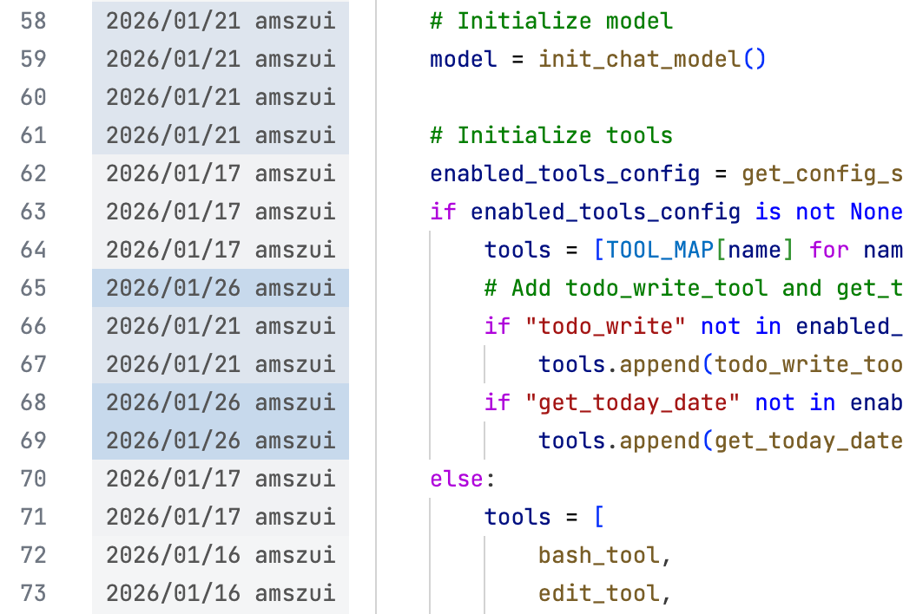

#  Git Blame Gutter

**Git Blame Gutter** is a Visual Studio Code extension that displays Git blame information directly in the editor gutter. It provides a quick and unobtrusive way to see who last modified a line and when, using a visual heat map to indicate the age of changes.

## Features

*   **Inline Blame Information**: Shows the commit date and author name in the gutter for every line.
*   **Age-Based Coloring**: Uses a dynamic blue color scale to visualize the age of commits.
    *   **Darker/Softer Blue**: Recent changes.
    *   **Lighter/Faded Blue**: Older changes.
*   **Real-time Updates**: Automatically updates blame information when you save or switch files.
*   **Unobtrusive UI**: Blame information is displayed in a dedicated gutter area, keeping your code clean.
*   **Toggleable**: Easily enable or disable the gutter via a command.

## Requirements

*   **Git**: Git must be installed and available in your system's PATH.
*   The file must be part of a Git repository.

## Usage

The extension is enabled by default. You can toggle it on or off using the Command Palette:

1.  Open the Command Palette (`Cmd+Shift+P` on macOS or `Ctrl+Shift+P` on Windows/Linux).
2.  Type **Git Blame Gutter: Toggle** and press Enter.

## Extension Settings

Currently, this extension does not have configurable settings. It uses a fixed width and color scheme optimized for readability.

## Known Issues

*   Very large files may take a moment to process the blame information.
*   Uncommitted changes are currently treated as "not committed yet" or ignored depending on the exact state (the extension gracefully handles this by not showing blame for uncommitted lines).

## Release Notes

### 0.0.1

*   Initial release of Git Blame Gutter.
*   Basic blame functionality with age-based coloring.

## License

[MIT](LICENSE.txt)

---

**Enjoying Git Blame Gutter?**  
If you find this extension helpful, please consider leaving a review on the Marketplace!
