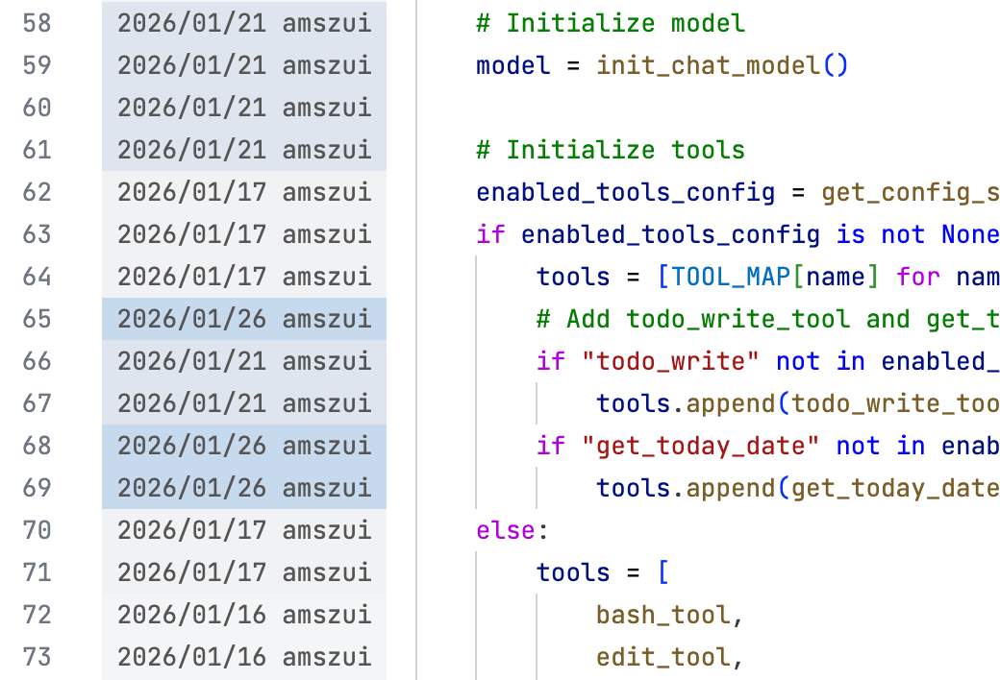

<div align="center">
  
  <h1>Git Blame Gutter</h1>
  <p>
    <strong>A visual and unobtrusive way to see Git blame information in VS Code.</strong>
  </p>
</div>

<br>

**Git Blame Gutter** displays Git blame information directly in the editor gutter. It helps you quickly identify who last modified a line and when, using a visual heat map to indicate the age of changes.

<div align="center">
  
</div>

## ✨ Features

- **Inline Blame Info**: Instantly see the commit date and author in the gutter.
- **Dynamic Heatmap**:
  - **Darker Blue**: Recent changes.
  - **Faded Blue**: Older changes.
- **Real-time Updates**: Blame info refreshes automatically on save or file switch.
- **Clean UI**: Unobtrusive design that keeps your code readable.
- **Toggleable**: Enable or disable with a simple command.

## 🚀 Installation

Since this extension is not yet published to the VS Code Marketplace, you can install it from the source code:

1. **Clone the repository** (if you haven't already):
   ```bash
   git clone https://github.com/amszuidas/git-blame-gutter.git
   cd git-blame-gutter
   ```

2. **Install dependencies and compile**:
   ```bash
   npm install
   npm run compile
   ```

3. **Package the extension**:
   ```bash
   npx vsce package
   ```
   This will generate a `.vsix` file (e.g., `git-blame-gutter-0.0.1.vsix`) in the project root.

4. **Install the .vsix file**:
   - **Command Line**:
     ```bash
     code --install-extension git-blame-gutter-0.0.1.vsix
     ```
   - **VS Code UI**:
     1. Go to the **Extensions** view (`Cmd+Shift+X` or `Ctrl+Shift+X`).
     2. Click the `...` (Views and More Actions) menu in the top-right corner.
     3. Select **Install from VSIX...**.
     4. Choose the generated `.vsix` file.

## 📖 Usage

The extension is **active by default** upon installation.

To toggle the gutter visibility:

1. Open the **Command Palette** (`Cmd+Shift+P` or `Ctrl+Shift+P`).
2. Run the command: `Git Blame Gutter: Toggle`.

## ⚙️ Requirements

- **Git**: Must be installed and available in your system's `PATH`.
- The open file must be part of a **Git repository**.

## 🔧 Settings

Currently, **Git Blame Gutter** is designed to be zero-config with an optimized fixed width and color scheme. Customization options may be added in future releases.

## 📝 Known Issues

- **Large Files**: Processing blame for very large files might have a slight delay.
- **Uncommitted Changes**: Lines with uncommitted changes are currently skipped to maintain clarity.

## 🤝 Contributing

Contributions are welcome! If you have suggestions or want to report a bug, please open an issue or submit a pull request on [GitHub](https://github.com/amszuidas/git-blame-gutter).

## 📄 License

This project is licensed under the [MIT License](LICENSE.txt).

---

<div align="center">
  <sub>Made with ❤️ by <a href="https://github.com/amszuidas">amszuidas</a></sub>
</div>
